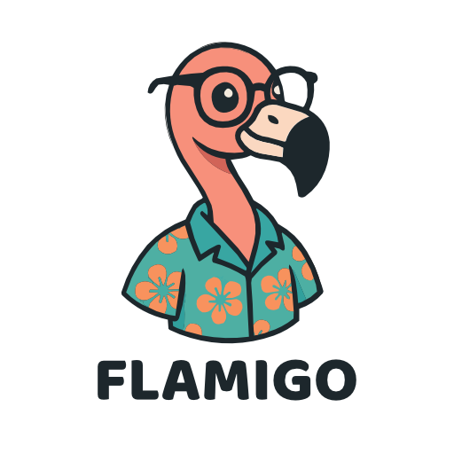

# Flamigo  
*A Domain-Driven Go Framework*
> [!IMPORTANT]  
> Flamigo currently is in a preview state. Tools may fail, and are in a very early stage. I'm using flamigo itself for some of my projects where I extracted it. Therefore there might be some loose ends still.

If you run into any issues please open a Issue



---

**Flamigo** is a lightweight and opinionated Go framework built around **Domain-Driven Design (DDD)** principles. It gives you structure without getting in your way — offering a clean architecture where domains, aggregates, and events are first-class citizens.

Whether you're working on a game backend, a microservice, or a monolith, Flamigo helps you write code that's easy to reason about, easy to scale, and fun to build on.

## 🦩 Why Flamigo?

Flamigo puts Domain principles at the heart of your application, encouraging you to think in terms of business logic and domain boundaries. With a modular design, clear separation of concerns, and minimal dependencies, it keeps things lean and understandable. Event-driven patterns are baked in from the start, making it easy to decouple logic without resorting to brittle hacks.

You get all the power of Go — fast builds, static typing, and simplicity — without sacrificing structure or long-term maintainability.

## Getting Started

Install the CLI tool:

```bash
go install github.com/amberbyte/flamigo/tools/flamigo@latest
```

Then start a new project:

```bash
flamigo init
```

This start a wizard and sets up the basic structure

## Docs

Documentation, examples, and design guides are available at  
👉 [flamigo.amberbyte.dev](https://flamigo.amberbyte.dev)

## Contributing

Pull requests, ideas, and issues are always welcome. If you're into Domain-Driven Go, we’d love your input. Check out [CONTRIBUTING.md](CONTRIBUTING.md) to get started.

## License

MIT — do whatever you want, just don’t remove the flamingo.