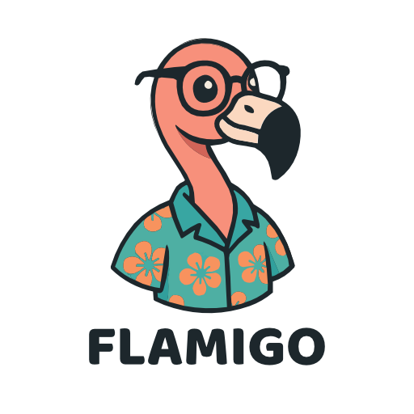

# Flamigo

Hexagonal, event-driven Go backend framework.

> [!IMPORTANT]
> Flamigo is still pre-1.0. The architecture is already usable, but APIs, templates, and tooling may still change between releases.



## What Flamigo Is

Flamigo is a backend framework for Go projects that want:

- domain-first structure
- hexagonal architecture
- event-driven coordination between domains
- transport adapters for HTTP and WebSocket-style applications
- lightweight dependency injection for startup wiring

It is designed for applications like game backends, internal platforms, modular monoliths, and services where domain boundaries matter more than raw CRUD scaffolding.

## What Flamigo Is Not

Flamigo is not trying to be:

- a full ORM or database framework
- a batteries-included auth product
- a frontend framework
- a giant “everything included” web framework

The framework gives you structure and reusable primitives. Application policy, persistence details, and adapter behavior still live in your app.

## Core Ideas

- `domains` hold business logic and domain contracts
- `events` carry domain events across the application
- `strategies` provide application actions that transports can invoke
- `adapters` connect the system to the outside world
- `injection` wires everything together at startup

## Getting Started

Install the CLI:

```bash
go install github.com/amberbyte/flamigo/tools/flamigo@latest
```

Create a project:

```bash
flamigo init
```

The wizard scaffolds a project and lets you enable optional features like:

- `auth`
- `transport_http`
- `transport_websocket`

## Documentation

Documentation and guides are available at:

[flamigo.amberbyte.dev](https://flamigo.amberbyte.dev)

## Release Guidance

If you are publishing the current state, prefer a pre-1.0 release line. `v0.1.0` or `v0.1.0-beta.1` fits the current maturity better than `v1.0.0-beta.1`.

## Contributing

Issues, ideas, and pull requests are welcome. See [CONTRIBUTING.md](CONTRIBUTING.md).

## License

MIT
